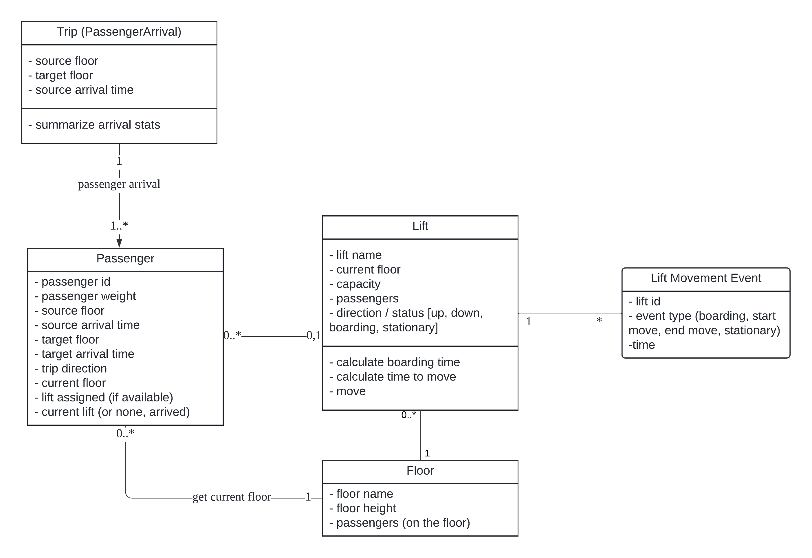
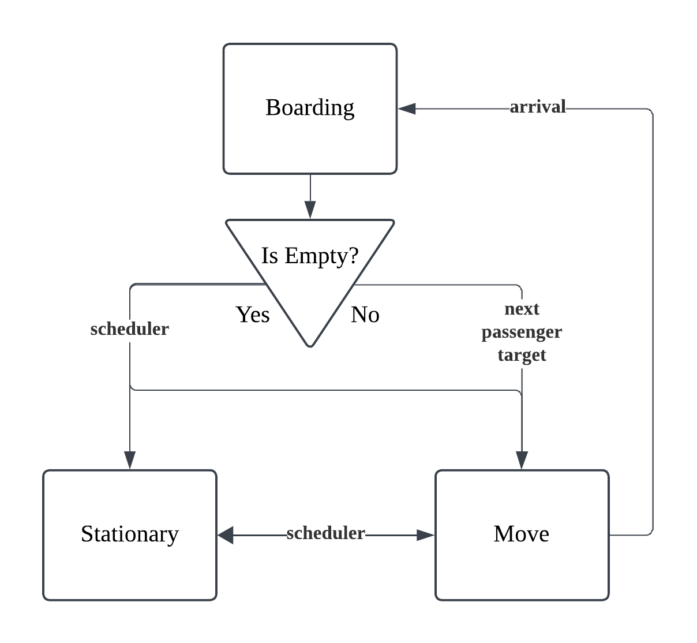

# Lift Optimizer
lift optimization dev

## ER Diagram:

## Lift State Transitions

## TODO:
- add column status for passenger list df apart from lift, to signify unassigned, in-progress, arrived
- setup lifts to respond to passenger requests while moving
- add log events for lifts apart from print into file
- use async for lift movement and boarding
- evaluate travel time
- setup lift assignment and preemptive movement input module
