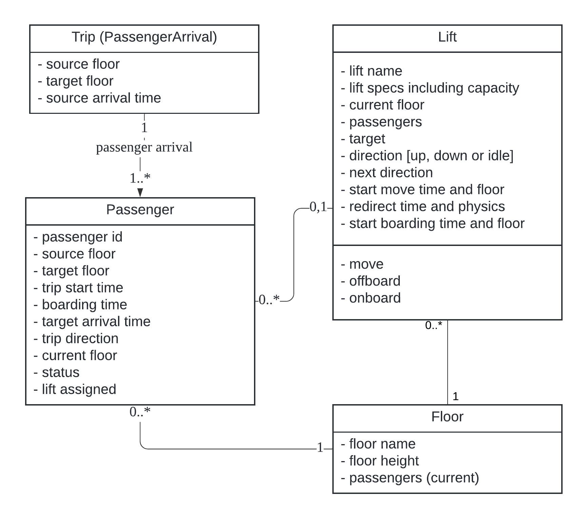
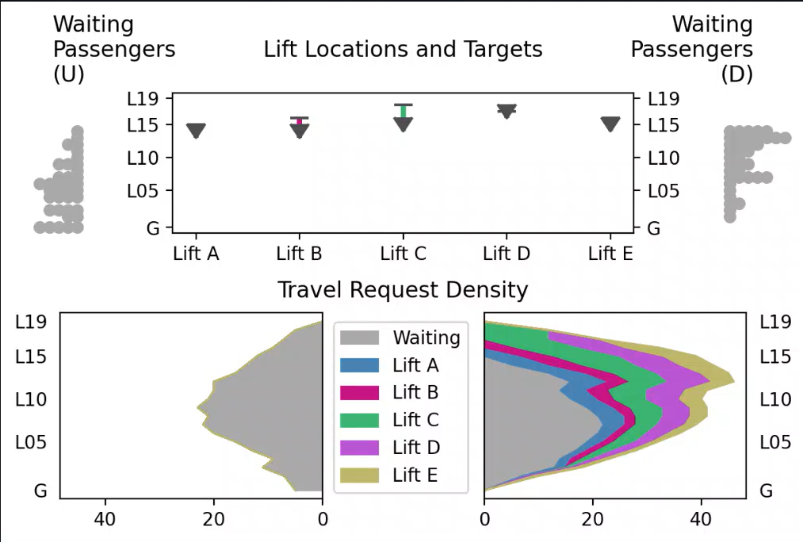

# Lift Optimizer
Proof of Concept for simulating, visualizing and ultimately optimizing lifts serving passengers on floors

# Demo
To run trial app, install python version 3.12.6. Then on terminal
```
pip install requirements.txt
streamlit run streamlit.py
```

# Optimization

## Objective:
- Minimize passenger travel time taking lifts, this includes
	1. time waiting for lifts
	2. time boarding on lifts
- Incur heavier penalty for passengers taking longer than a specified time

## Constraints:
- lifts onboard passengers, move, and offboard them at their destinations
- lifts have a capacity limit
- when not vacant, lifts move to serve passengers onboard, i.e. not allowed to stay idle or move in opposite direction

The time for lifts to move is found in lift specification. Default acceleration model has a constant acceleration and maximum speed limit for a physics model serving different height of floors, without regard for carrying load.
Time for lifts to off-board and on-board is 0.5 and 1.5 s per passenger respectively when lift has less or more than half of its capacity.

## Sample Usage
```
python usage_travel.py
python usage_lift_state.py
python usage_simulation.py
```

## Passenger States


## ER Diagram


## Baseline model

### Baseline Lift States


In baseline model, lifts serve existing targets while attending to the most immediate request.

Passenger are assigned in this model, so that:
1. Lifts do not simultaneously reach out to the same immediate targets
2. Marking passengers of immediate target floors so remaining lifts can calculate a potential u-turn

The Baseline model
- assigns passengers following the immediate nearest floor along the direction of lift, subject to lift capacity
- passenger assignment with `assign_multi = True` (passengers can be assigned to multiple lifts); the taking lift will be the first arriving lift
- `bypass_prev_assignment = True`: assignments can be bypassed; first arriving lift heading in same direction will take the passenger
- passenger onboarding priority is from *earliest arrival*; first arriving passenger will take the lift
- moving lifts can be redirected from existing target, if it has capacity and is able to reach new target along the same direction before exising target
- lift redirection frees passengers from previous assignment
- when a new passenger arrives, the nearest lift is searched to assign for the passenger according to existing remaining capacity
- when a redirection takes place, previous assignment passengers are try-searched for stationary lifts to assign them
- lift do not make any movement when no passenger is in lift or assigned to that lift while waiting

Baseline model current drawbacks and potential improvements:
- Without further coordination, lifts tend to cluster their positions over time
- Unless there are boarding passengers, not more than one lift will target the same floor at same time. This can be non-optimal when the floor has more passengers than for one lift.
- Lift assignment and movement does not consider potential new passenger requests in the future. It can be non-optimal for lift stationing and moving once passengers arrive.
- Lifts do not coordinate to segregate targeted passengers, as they serve immediately passengers who arrive the earliest. This is non-optimal in having to serve more floors and take more stops.



## TODO:
- evaluate travel time
- modularize lift coordination
